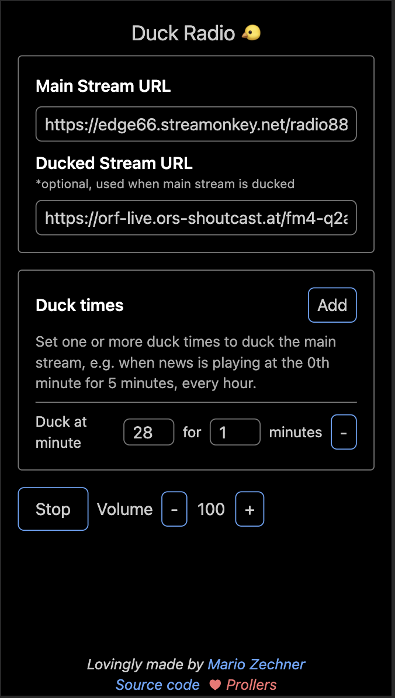

# Duck Radio

Duck Radio let's you listen to a radio stream and "duck" out news broadcasts that occur at specific times each hour for a specific
number of minutes. During that ducking time, you can listen to an
alternative radio stream that doesn't have news playing.

How to use Duck Radio:

1. Enter your main radio stream URL
2. Enter an alternative radio stream URL
3. Specify the times and duration there's news on air
4. Click `Play` start your radio experience without news

Your settings will be stored on your device, so you don't need to fiddle around every time you reload the site.

# Running Duck Radio locally

Just open the index.html file in your browser

# Development

1. Install NodeJS
2. `npm install`
3. `npm run dev`
4. Run the `nonewsradio` configuration in VS Code for debugging.

# Deployment

Just copy `index.html` and `index.js` to some web server you can publicly access.
